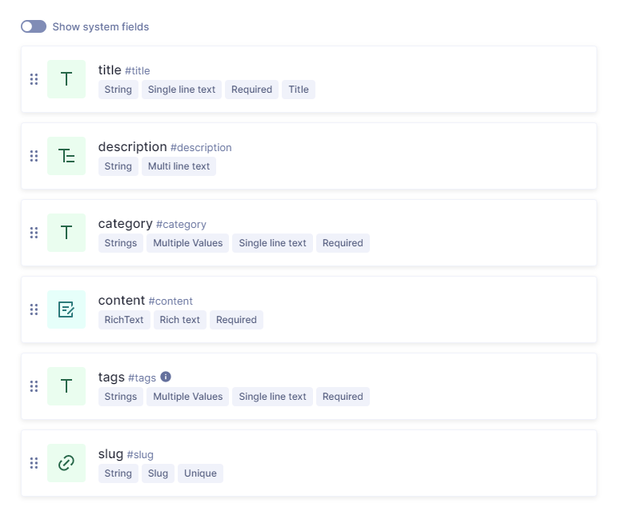

# Türkçe

---

[Canlı önizleme](https://kudretyilmaz.me)

Teknoloji Yığını: TypeScript, React/Next JS, Redux Toolkit,i18Next, Hygraph (Graphcms), Tailwind CSS, Framer Motion

**Açıklama:** Kolaylıkla kişilleştirebileceğiniz portfolyo ve Blog içeriği yayımlamak için kullanabileceğiniz, gece moduna ve çoklu dil desteğine sahip bir web uygulamasıdır.

## Kurulum

1. Repoyu bilgisayarınıza klonlayın.
2. Proje klasörüne gidin ve terminalinizi açın.
3. `npm install` veya `yarn install` komutunu kullanarak bağımlılıkları yükleyin.
4. hygraph.com'da hesap oluşturun ve aşağıdaki gibi 'blogpost' adında bir schema oluşturun:

5. hygraph.com üzerinde content api adresini ve alın ve okuma iznini açın.
6. Aldığınız api adresini, ana dizin bir .env dosyası oluşturup içine aşağıdaki gibi ekleyin:
   `NEXT_PUBLIC_END_POINT: https://your-api.com`

## Kişiselleştirme

1. Ana dizindeki `project.json` içindeki bilgileri kendinize göre düzenleyin.
2. Doğrudan `/locales` altındaki çeviri dosyalarının içeriğini kendinize göre düzenleyin.
3. `/public/images` altındaki cv.pdf dosyasını ve hero-image.jpeg dosyalarını kendi özgeçmişiniz ve fotoğrafınızla değiştirin. (Hata almamak için isimlerini aynı tutmaya özen gösterin.)

## Dağıtım

Projenizi vercel ve benzeri sağlayıcılar üzerinde kolayca deploy edebilirsiniz.

# English

---

[Live preview](https://kudretyilmaz.me/en)

Tech Stack: TypeScript, React/Next JS, Redux Toolkit,i18Next, Hygraph (Graphcms), Tailwind CSS, Framer Motion

**Description:** It is a web application with night mode and multi-language support that you can use to publish portfolio and blog content that you can easily customize.

## Setup

1. Fork the repo and clone it to your computer.
2. Go to the project folder and open your terminal.
3. Install dependencies using `npm install` or `yarn install`.
4. Create account at hygraph.com and create a schema named 'blogspot' as below:

5. Get content api address and on hygraph.com and turn on read permission.
6. Create an .env file in the home directory and add the api address you received as follows:
   `NEXT_PUBLIC_END_POINT: https://your-api.com`

## Customize

1. Customize the information in the `project.json` in the home directory.
2. Customize the content of translation files directly under `/locales`.
3. Replace the cv.pdf and hero-image.jpeg files under `/public/images` with your own resume and photo. (Make sure to keep their names the same to avoid mistakes.)

## Deployment

You can easily deploy your project on vercel and similar providers.
